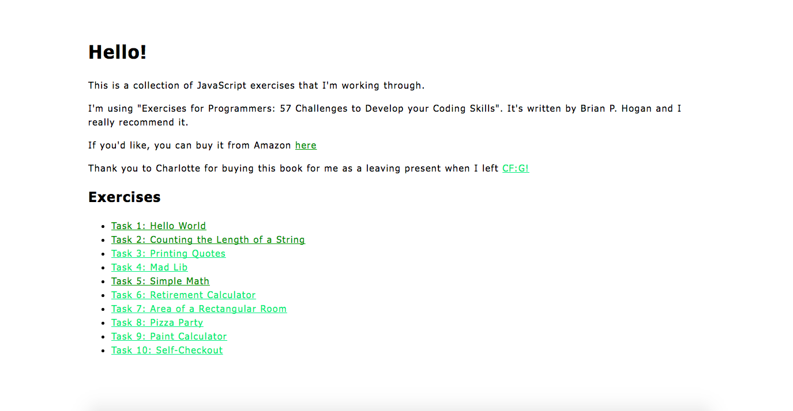

# JavaScript-57-Exercises-for-Programmers

In this learning project, I'm working through each of the 57 exercises in Brian P. Hogan's book, 'Exercises for Programmers: 57 Challenges to Develop your Coding Skills', in JavaScript.

I've created a site and I'm adding each challenge onto a list on the home page as I go!

Visit this site here: [https://bnewing.github.io/JavaScript-57-Exercises-for-Programmers/](https://bnewing.github.io/JavaScript-57-Exercises-for-Programmers/)

## 1. Technologies Used

- HTML
- CSS
- JavaScript

## 2. How to Suggest a Change

Feedback is very welcome! To suggest a change, either raise an issue, or fork and clone the project and create a pull request using the steps listed here:

https://help.github.com/articles/creating-a-pull-request-from-a-fork/

## 3. What the Project Looks Like

